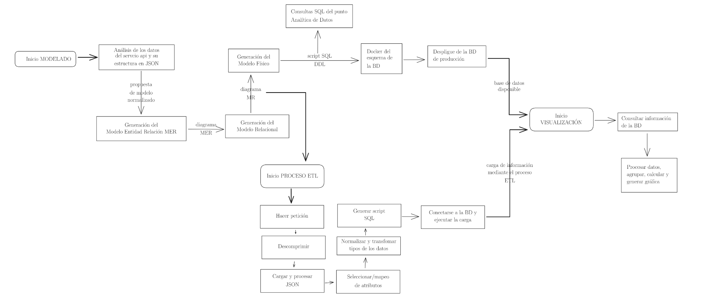
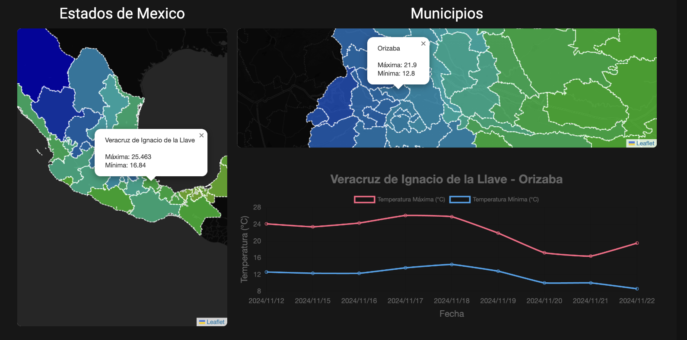

# Proyecto Final BDE CLIMA

- Aguilar Martinez Erick Yair
- Ahuatzi Pichardo Mariano Josué
- Martinez Muñoz Alan Magno
- Mendoza Hernandez Carlos Emiliano

## Objetivo

Como parte de nuestra formación en la materia de Bases de Datos Estructuradas,
desarrollaremos el presente proyecto, cuyo propósito es aplicar los conocimientos adquiridos en el curso para resolver un problema real relacionado con la gestión y análisis de datos climáticos en México.

El Gobierno de México, como parte de su política pública, ofrece acceso a información relativa al clima del país a través de un servicio web. No obstante, la estructura
y formato de estos datos no están diseñados para facilitar un análisis profundo o automatizado, lo que representa un desafío importante en términos de estandarización y
gestión eficiente de la información.

Nuestro objetivo principal es extraer, transformar y cargar los datos proporciona-
dos por este servicio web, con el fin de automatizar y estandarizar el flujo de información. Esto permitirá convertir los datos crudos en información estructurada y processable, facilitando su uso para análisis meteorológicos, elaboración de reportes y aplicaciones basadas en datos climáticos.

## Flujo de Trabajo

La imagen que se encuentra al final ilustra nuestro de flujo del proceso ETL (Extract, Transform, Load).

- **Extracción:** Recuperación de datos del servicio web.
- **Transformación:** Procesamiento y estandarización de los datos para que sean procesables.
- **Carga:** Integración de los datos en una base de datos estructurada, facilitando su análisis.

## Interfaz de Usuario (UI)

Una parte importante es la visualización de la información por ello planteamos el siguiente dashboard que permita la toma de decisiones y/o análisis.

- **Visualización:** Mostrar métricas y estadísticas de datos climáticos.
- **Interactividad:** Permitir la interacción del usuario para explorar diferentes aspectos de los datos.
- **Monitorización:** Facilitar la toma de decisiones mediante la representación gráfica de la información.

